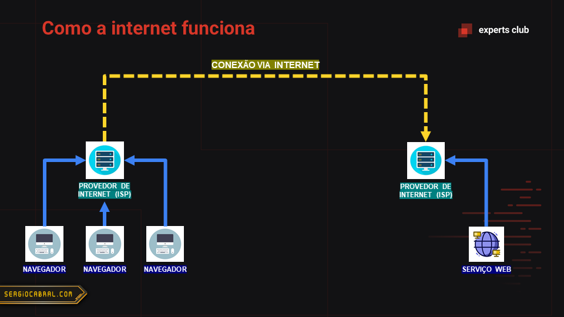
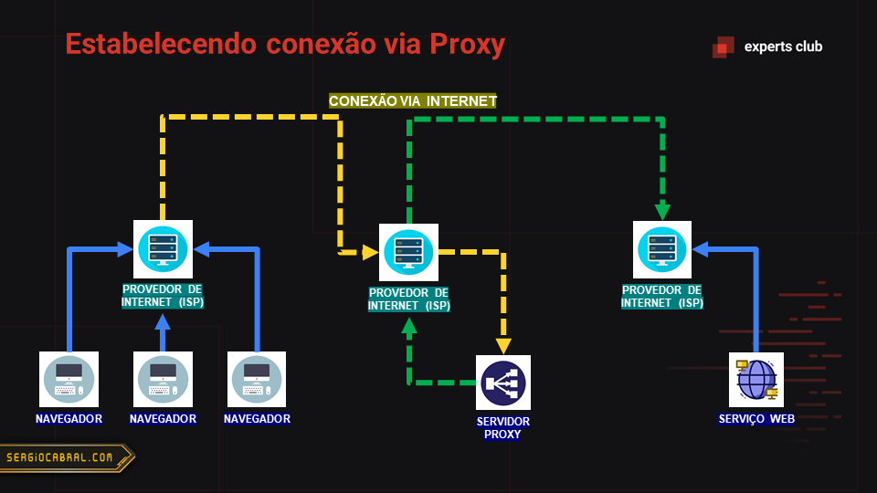
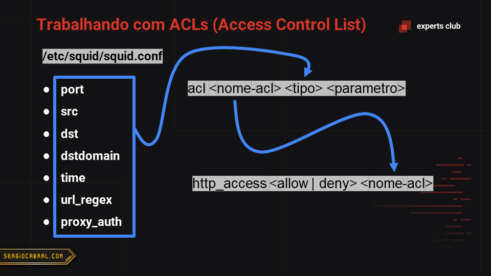
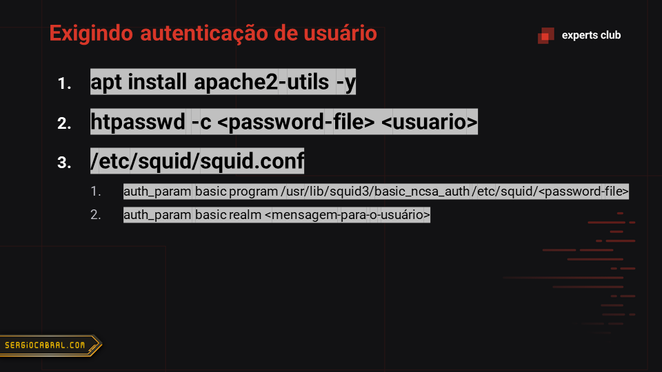

# Docker.Squid

Servidor proxy usando Squid.

- Imagem no [hub.docker.com](https://hub.docker.com/r/sergiocabral/squid)
- Comando de única linha para configurar uma VM Linux Debian como servidor Proxy:
  - `sudo apt update && sudo apt install docker.io -y && sudo docker run -e SQUID_USERS="username1=password1,username2=password2,username3=password3" -e SQUID_LOGIN_MESSAGE="Mensagem de boas-vindas" -e SQUID_ALLOW_UNSECURE="true" -p 80:3128 sergiocabral/squid`
    - Altere os usuários e senhas.
    - Defina a mensagem de boas-vindas.
    - Certifique-se se vai usar mesmo a porta 80.

## Slides da aula











## Configuração

É possível configurar usuário e senha através de variáveis de ambiente.

Ou você pode ignorar variáveis de ambiente e usar diretamente o arquivo `squid.conf`.

## Variáveis de ambiente

`SQUID_USERS` = `username1=password1,username2=password2,username3=password3`

 - Informe usuário e senha no formato acima para habilitar a autenticação ao servidor proxy.

`SQUID_LOGIN_MESSAGE` = `Your Login Message Here`

- Mensagem (realm) exibida durante o processo de login.

`SQUID_ALLOW_UNSECURE` = `true`

- Apenas `true` é um valor possível. Sinaliza que é permitido o acesso à portas não usuais.
- Quando não informado, ou tendo um outro valor, irá permitir apenas as seguintes portas consideradas seguras:
	- 21, ftp
	- 70, gopher
	- 80, http
	- 210, wais
	- 280, http-mgmt
	- 443, https
	- 488, gss-http
	- 591, filemaker
	- 777, multiling http
	- 1025-65535, unregistered ports

## Sugestão de diretórios para volumes Docker.

`/etc/squid.templates`

- Use os arquivos `/etc/squid.templates/*.template` para criar os arquivos finais em `/etc/squid.conf` com a devida substituição de referências à variáveis de ambiente pelos seus respectivos valores.

`/etc/squid.conf`

- Diretório de configuração usado pelo Squid. Todos os arquivos de configuração estão aqui.

`/var/log/squid`

- Arquivos de log.

## Exposição de porta

A porta padrão do Squid é 3128. Mas pode ser modificada no arquivo `squid.conf`.

## Exemplo para *docker-compose.yml*

```
version: "3.3"
services:
  proxy:
    image: sergiocabral/squid
    ports:
      - 8080:3128
    volumes:
      - /docker-volumes/squid/templates:/etc/squid.templates
      - /docker-volumes/squid/conf:/etc/squid.conf
      - /docker-volumes/squid/log:/var/log/squid
    environment:
      - SQUID_USERS=username1=password1,username2=password2,username3=password3
      - SQUID_LOGIN_MESSAGE=Cabrones Proxy Server
      - SQUID_ALLOW_UNSECURE=true
```

## Expert

| [](https://github.com/sergiocabral) |
| :-: |
|[sergiocabral.com](https://sergiocabral.com)|


